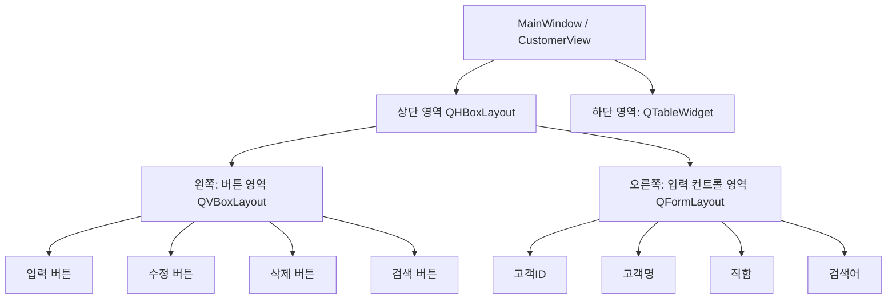

# PRD - 고객정보 관리 프로그램 (MyCust)

## 1. 개요
- **목적**: PyQt(또는 PySide) 기반 GUI와 SQLite3 데이터베이스를 이용하여 고객 정보(고객ID, 이름, 직함)를 입력/수정/삭제/검색할 수 있는 데스크톱 프로그램을 개발한다.
- **파일 구성**
  - 소스코드: `MyCust.py`
  - 데이터베이스 파일: `MyCust.db`

## 2. 데이터베이스 설계

### 2.1 테이블: Customers

| 컬럼명     | 타입    | 제약조건                                  | 설명            |
|-----------|--------|-------------------------------------------|-----------------|
| custID    | INTEGER | PRIMARY KEY AUTOINCREMENT                 | 고객 고유 번호  |
| custName  | TEXT    | NOT NULL                                  | 고객 이름       |
| custTitle | TEXT    |                                            | 고객 직함/직책  |

### 2.2 DDL (예시)
```sql
CREATE TABLE IF NOT EXISTS Customers (
    custID INTEGER PRIMARY KEY AUTOINCREMENT,
    custName TEXT NOT NULL,
    custTitle TEXT
);
```

## 3. 클래스 설계

### 3.1 `CustomerManager` (데이터베이스 처리 담당)
- SQLite3 연결/해제 및 CRUD(Create, Read, Update, Delete) 로직만 담당하며, 화면(UI) 관련 코드를 포함하지 않는다.

| 메서드                                   | 설명                                             |
|------------------------------------------|--------------------------------------------------|
| `__init__(self, db_path="MyCust.db")`    | DB 연결 및 테이블 생성(없을 경우)                 |
| `create_table(self)`                     | Customers 테이블 생성 (IF NOT EXISTS)             |
| `add_customer(self, custName, custTitle)`| 신규 고객 입력 (INSERT)                           |
| `update_customer(self, custID, custName, custTitle)` | 기존 고객 정보 수정 (UPDATE)          |
| `delete_customer(self, custID)`          | 고객 정보 삭제 (DELETE)                           |
| `search_customer(self, keyword)`         | 이름 기준으로 고객 검색 (LIKE 조회)               |
| `get_all_customers(self)`                | 전체 고객 목록 조회 (SELECT *)                    |
| `close(self)`                            | DB 연결 종료                                      |

### 3.2 `CustomerView` (화면 처리 담당)
- PyQt(QWidget/QMainWindow 등)를 상속받아 화면 구성 및 이벤트 처리를 담당한다.
- 내부적으로 `CustomerManager` 인스턴스를 생성하여 데이터 처리를 위임한다 (화면 클래스가 직접 SQL을 다루지 않음).

| 메서드/기능                  | 설명                                                |
|-------------------------------|-----------------------------------------------------|
| `__init__(self)`              | UI 초기화 및 `CustomerManager` 인스턴스 생성, 목록 로딩 |
| `init_ui(self)`                | 레이아웃 및 위젯 배치                                |
| `load_customer_list(self)`     | `CustomerManager.get_all_customers()` 호출 후 테이블에 표시 |
| `on_add_clicked(self)`         | 입력 버튼 클릭 시 `add_customer` 호출 후 목록 갱신    |
| `on_update_clicked(self)`      | 수정 버튼 클릭 시 `update_customer` 호출 후 목록 갱신 |
| `on_delete_clicked(self)`      | 삭제 버튼 클릭 시 `delete_customer` 호출 후 목록 갱신 |
| `on_search_clicked(self)`      | 검색 버튼 클릭 시 `search_customer` 호출 후 결과 표시 |
| `on_table_row_selected(self)`  | 테이블에서 행 선택 시 입력 컨트롤에 값 자동 채움     |
| `clear_inputs(self)`           | 입력 컨트롤 초기화                                   |

## 4. 화면(UI) 설계

### 4.1 레이아웃 구조
- 전체 화면은 상단 영역과 하단 영역으로 구분.
  - **상단 영역**: 좌우 분할
    - **왼쪽 (버튼 영역)**: 세로로 배치된 버튼
      - 입력(Add) 버튼
      - 수정(Update) 버튼
      - 삭제(Delete) 버튼
      - 검색(Search) 버튼
    - **오른쪽 (입력 컨트롤 영역)**
      - 고객ID 표시/입력란 (`QLineEdit`, 자동증가이므로 읽기 전용 또는 검색/수정 시 참조용)
      - 고객명 입력란 (`QLineEdit`)
      - 직함 입력란 (`QLineEdit`)
      - 검색어 입력란 (`QLineEdit`, 검색 버튼과 함께 사용)
  - **하단 영역**: `QTableWidget`
    - 컬럼: 고객ID, 고객명, 직함
    - 전체 고객 목록 또는 검색 결과 출력
    - 행 클릭 시 선택된 데이터가 오른쪽 입력 컨트롤에 자동으로 채워짐 (수정/삭제 시 활용)

### 4.2 레이아웃 구조도 (Mermaid)


## 5. 기능 요구사항

| 기능 | 설명 |
|------|------|
| 입력 | 고객명, 직함을 입력받아 신규 고객 등록. custID는 자동 증가. |
| 수정 | 테이블에서 선택한 고객의 정보를 입력 컨트롤에서 수정 후 반영. |
| 삭제 | 테이블에서 선택한 고객을 custID 기준으로 삭제. |
| 검색 | 검색어(고객명 등)로 고객 목록 조회 후 테이블에 결과만 표시. |
| 목록 표시 | 프로그램 실행 시 및 각 작업(입력/수정/삭제/검색) 후 `QTableWidget`에 최신 목록 반영. |
| 행 선택 연동 | 테이블 행 클릭 시 해당 데이터가 오른쪽 입력 컨트롤에 채워짐. |

## 6. 비기능 요구사항
- 데이터베이스 파일(`MyCust.db`)은 프로그램 최초 실행 시 자동 생성.
- 예외 처리: DB 연결 실패, 필수 입력값 누락(고객명 등), 선택 항목 없이 수정/삭제 시도 등에 대한 사용자 안내(메시지박스 등).
- `CustomerManager`와 `CustomerView`는 서로 역할이 분리되어 있어, UI 프레임워크 변경 시에도 `CustomerManager`는 재사용 가능해야 함.

## 7. 향후 구현 순서 (참고, 이번 단계에서는 코드 미생성)
1. `CustomerManager` 클래스 구현 (DB 연결, 테이블 생성, CRUD 메서드)
2. `CustomerView` 클래스 UI 골격 구현 (레이아웃, 위젯 배치)
3. 버튼 이벤트와 `CustomerManager` 메서드 연동
4. 테이블 목록 갱신 및 행 선택 연동 기능 구현
5. 예외 처리 및 사용자 메시지 보완
